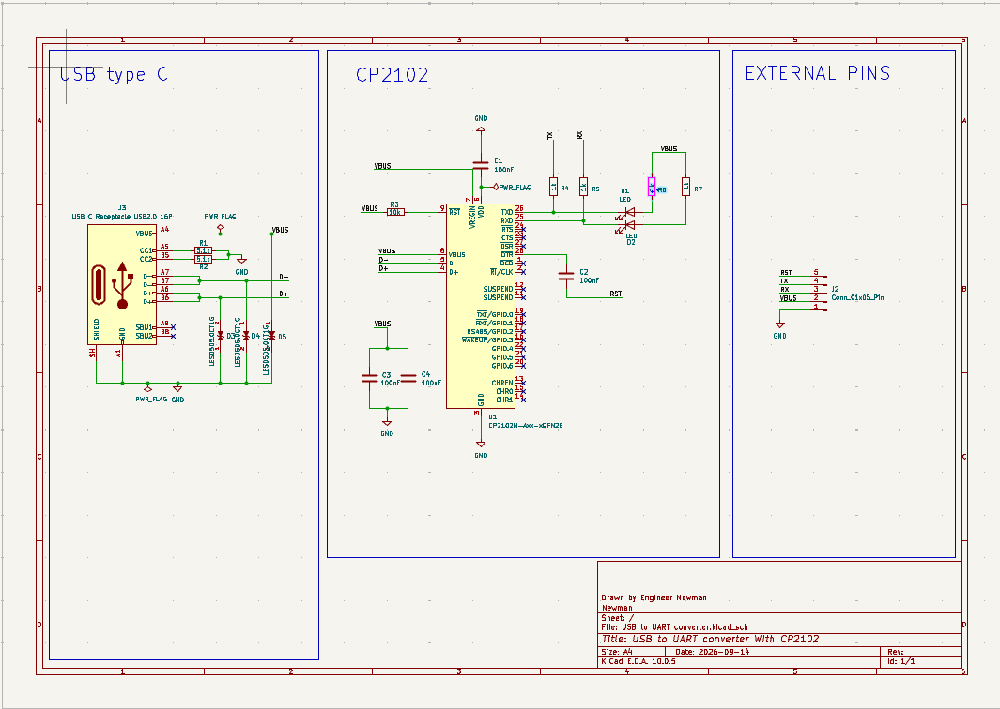
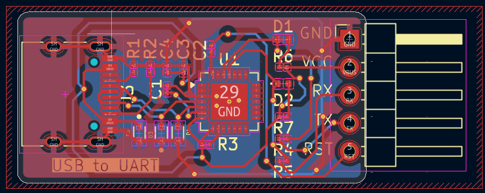
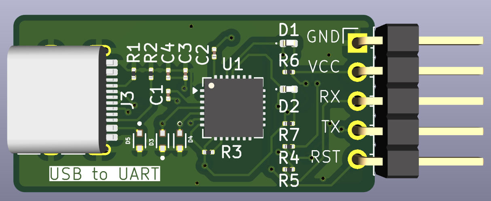

# USB to UART Converter with CP2102

## Overview

A USB to UART converter PCB designed in **KiCad** using the Silicon Labs CP2102 USB-to-UART bridge IC.

This project was completed as a hands-on PCB design exercise based on the *Master KiCad with Projects* YouTube tutorial series. The project provided practical experience with schematic capture, component selection, PCB layout, component placement, routing, and design-rule checking.

## Project Goals

* Design a USB-to-UART interface using the CP2102
* Create the complete schematic in KiCad
* Select and connect the required supporting components
* Design a compact PCB layout
* Practice component placement and signal routing
* Create a complete, organized KiCad project suitable for PCB fabrication

## Tools

* **KiCad**
* **CP2102 USB-to-UART bridge**

## Design Process

### 1. Schematic Design

The circuit schematic was created in KiCad, including the CP2102 and its required supporting components for USB-to-UART communication.

### 2. PCB Layout

The schematic was transferred to the PCB editor, where components were placed and the electrical connections were routed.

### 3. 3D Visualization

KiCad's 3D viewer was used to inspect the completed PCB layout and component placement.

## Skills Practiced

* Schematic capture
* Component selection
* PCB component placement
* PCB routing
* Signal routing
* PCB layout optimization
* Design Rule Checking (DRC)
* KiCad project organization
* USB/UART interface fundamentals

## Project Files

The `KiCad` folder contains the original KiCad project files:

* `.kicad_pro` — KiCad project configuration
* `.kicad_sch` — Schematic
* `.kicad_pcb` — PCB layout

## Reference

This project was based on the following tutorial:

**Master KiCad with Projects — USB to UART Converter with CP2102**

YouTube tutorial series: *Master KiCad with Projects*

## Project Status

**Completed — PCB design finished. DRC checks and edits in proccess**

This project was created as a learning exercise. Future versions may include design modifications, fabrication, assembly, and functional testing of the completed board.
