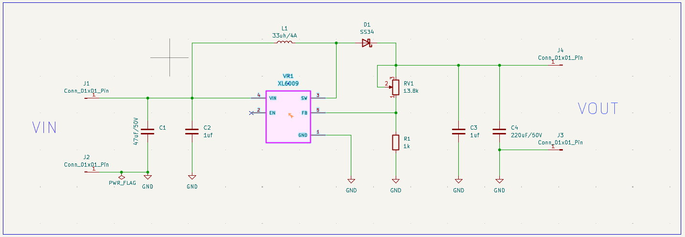
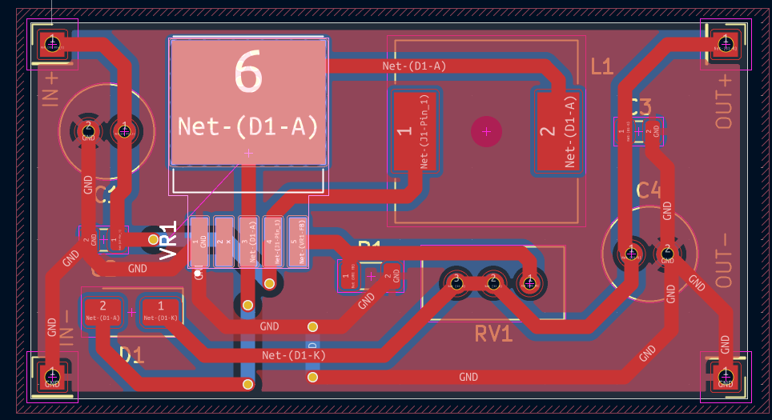
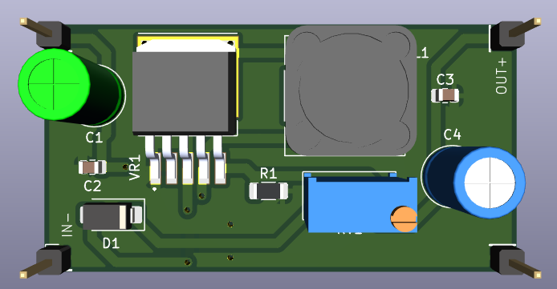

# DC-DC Boost Converter

## Overview

An **XL6009-based DC-DC boost converter** designed in KiCad from schematic through PCB layout and 3D visualization.

The circuit is based on the typical boost converter application circuit provided in the **XL6009 datasheet**. The reference circuit was used as the starting point, with the components selected and the complete schematic, PCB layout, and 3D model developed in KiCad.

### Project Workflow

- Created the schematic in KiCad
- Selected and assigned component footprints
- Added a custom XL6009 symbol, footprint, and 3D model
- Designed the PCB layout
- Added thermal vias around the XL6009 for improved heat dissipation
- Added a 3D model for the DR125 inductor
- Created the complete 3D PCB visualization
- Ran Electrical Rules Check (ERC)
- Ran Design Rules Check (DRC)

---

## Design Specifications

| Parameter | Value |
|---|---|
| Converter Type | DC-DC Boost Converter |
| Switching Regulator | XL6009 |
| Reference Input Range | 12–16 V |
| Target Output Voltage | ~18.5 V |
| Inductor | 33 µH / 4 A |
| Schottky Diode | SS34 |
| Input Bulk Capacitor | 47 µF / 50 V |
| Input Ceramic Capacitor | 1 µF |
| Output Bulk Capacitor | 220 µF / 50 V |
| Output Ceramic Capacitor | 1 µF |
| Feedback Resistor | 1 kΩ |
| Feedback Resistance | 13.8 kΩ |
| PCB Design Software | KiCad |

The input voltage range and target output voltage are based on the XL6009 datasheet reference design.

---

## How a Boost Converter Works

A boost converter is a switching DC-DC converter that produces an output voltage higher than its input voltage.

The XL6009 controls the switching process. Energy is temporarily stored in the inductor and then transferred to the output at a higher voltage.

The conversion process can be understood in two main stages.

### 1. Switch ON

When the internal switch in the XL6009 turns ON, current flows from the input supply through the inductor.

The inductor stores energy in its magnetic field.

During this portion of the switching cycle, the Schottky diode prevents the output capacitor from discharging back toward the switching node.

### 2. Switch OFF

When the internal switch turns OFF, the magnetic field in the inductor collapses.

The inductor generates a voltage that adds to the input voltage, causing current to flow through the Schottky diode toward the output.

The output capacitors store this energy and help maintain a stable DC output voltage.

The XL6009 rapidly repeats these switching cycles to transfer energy from the input to the output and increase the voltage.

---

## Circuit Operation

The main power path of the converter is:

VIN → L1 → Switching Node → D1 → VOUT

The XL6009 controls the switching node while L1 stores and releases energy during each switching cycle.

D1 provides the path from the inductor to the output when the internal switch turns OFF.

The output capacitors then filter the resulting switching waveform into a DC output.

---

## Output Voltage Feedback

The XL6009 regulates the output voltage using its **FB (feedback) pin**.

A resistor divider is connected between VOUT and GND:

             VOUT
               |
              RV1
             13.8 kΩ
               |
               +------ FB
               |
              R1
             1 kΩ
               |
              GND

The XL6009 uses the voltage at the FB pin to regulate the switching operation.

The datasheet provides the following relationship:

VOUT = 1.25 × (1 + R2/R1)

Using the selected values:

R1 = 1 kΩ
R2 = 13.8 kΩ

VOUT = 1.25 × (1 + 13.8 kΩ / 1 kΩ)

VOUT ≈ 18.5 V

The feedback network therefore sets the target output voltage to approximately **18.5 V**.

---

## Component Selection

### XL6009

The **XL6009** is the main switching regulator in the circuit.

It controls the switching operation required to transfer energy through the inductor and regulate the output voltage.

A custom KiCad symbol, PCB footprint, and 3D model were added to the project.

The custom XL6009 files are included in the project repository so that the design does not depend on the original local library files.

---

### L1 — 33 µH / 4 A Inductor

The inductor is the primary energy-storage component in the boost converter.

When the XL6009's internal switch is ON, current flows through L1 and energy is stored in its magnetic field.

When the switch turns OFF, the stored energy is released toward the output through the Schottky diode.

The selected inductor is rated for approximately 4 A according to the reference design.

A **DR125 3D model** was also included for the PCB's 3D visualization.

---

### D1 — SS34 Schottky Diode

The SS34 is a Schottky diode used to transfer energy from the inductor to the output.

Schottky diodes are commonly used in switching converters because of their relatively low forward voltage and fast switching characteristics.

The diode also prevents the output from discharging back toward the switching node when the XL6009's internal switch is ON.

---

### R1 and RV1 — Feedback Network

R1 and RV1 form the feedback voltage divider used to control the output voltage.

- R1 = 1 kΩ
- RV1 = 13.8 kΩ

The resulting feedback voltage is monitored by the XL6009 through its FB pin.

---

### C1 — 47 µF / 50 V Input Capacitor

C1 is the main input bulk capacitor.

It helps stabilize the input supply and reduces voltage fluctuations caused by the switching current drawn by the converter.

The 50 V rating also provides voltage margin above the intended input range.

---

### C2 — 1 µF Input Capacitor

C2 provides additional high-frequency filtering on the input side.

The smaller capacitor complements the larger bulk capacitor by helping filter higher-frequency switching components.

---

### C3 — 1 µF Output Capacitor

C3 provides additional high-frequency filtering on the output.

It works together with the larger output capacitor to reduce high-frequency voltage ripple.

---

### C4 — 220 µF / 50 V Output Capacitor

C4 is the main output bulk capacitor.

It stores energy delivered by the converter and helps reduce output-voltage ripple and fluctuations.

---

## PCB Layout Considerations

Because the XL6009 operates as a switching regulator, PCB layout is an important part of the design.

The PCB layout was developed with consideration for:

- Short current paths around the switching circuitry
- Placement of the inductor and Schottky diode near the XL6009
- Adequate copper area for higher-current connections
- Ground copper areas
- Input and output capacitor placement
- Appropriate trace clearances
- Thermal management around the XL6009

The completed PCB was checked using KiCad's Design Rules Checker (DRC).

---

## Thermal Management

The XL6009 is the primary switching device and can dissipate heat during operation.

**Thermal vias were added around the XL6009 on the PCB to provide an additional path for heat to spread into the PCB copper.**

The copper areas and thermal vias help distribute heat away from the regulator and improve the PCB's ability to dissipate heat.

The thermal-via implementation was included as part of the PCB layout rather than relying only on the component package for heat dissipation.

---

## Schematic

The schematic was developed in KiCad using the XL6009 datasheet reference circuit as the starting point.

---

## PCB Layout

The PCB was designed and routed in KiCad.

---

## 3D Visualization

A 3D model was created to visualize the completed PCB and component placement.

Custom 3D models were included for components that were not available in the standard KiCad libraries.

---

## Design Verification

### Electrical Rules Check (ERC)

KiCad's Electrical Rules Checker (ERC) was run on the completed schematic to identify potential electrical connection and schematic-rule issues.

### Design Rules Check (DRC)

KiCad's Design Rules Checker (DRC) was run on the completed PCB layout to check PCB design constraints including:

- Trace clearances
- Connectivity
- Unconnected items
- PCB design-rule violations

---

## Custom KiCad Libraries and Models

The project includes the custom files required for the XL6009 and the PCB 3D visualization.

### XL6009

The `XL6009` folder contains:

- Custom schematic symbol
- Custom PCB footprint
- Custom 3D model

These files are included with the project so that the custom XL6009 component can be retained when the project is opened on another computer.

### DR125 Inductor

The project also includes the `DR125.STEP` 3D model used to represent the 33 µH inductor in KiCad's 3D Viewer.

---

## Tools Used

- **KiCad**
- XL6009 datasheet
- KiCad Schematic Editor
- KiCad PCB Editor
- KiCad 3D Viewer

---

## Project Files

The `KiCad` directory contains the complete KiCad project, including:

- Schematic
- PCB layout
- KiCad project configuration
- Custom XL6009 symbol
- Custom XL6009 footprint
- Custom XL6009 3D model
- DR125 inductor 3D model
